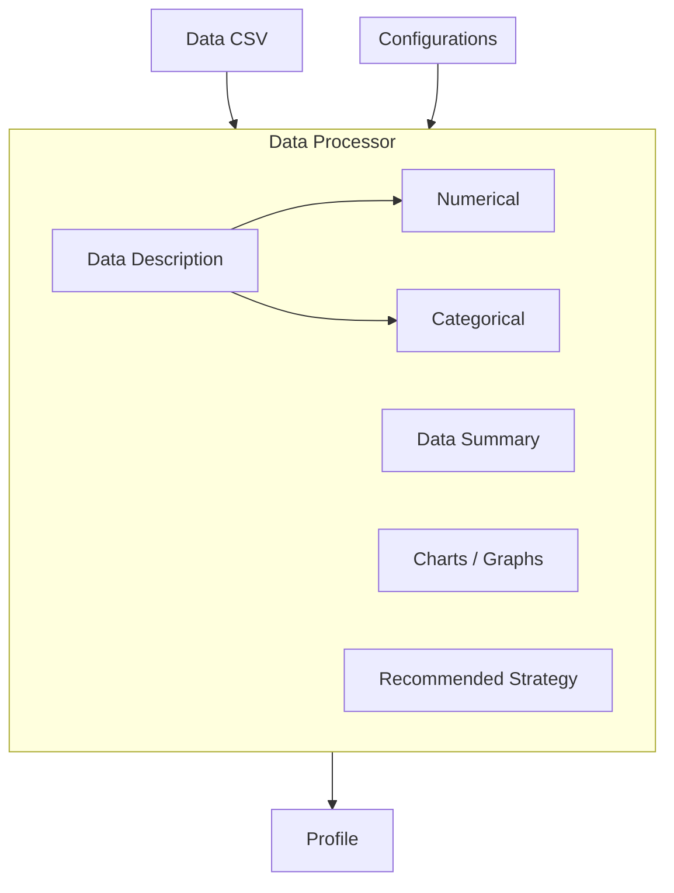
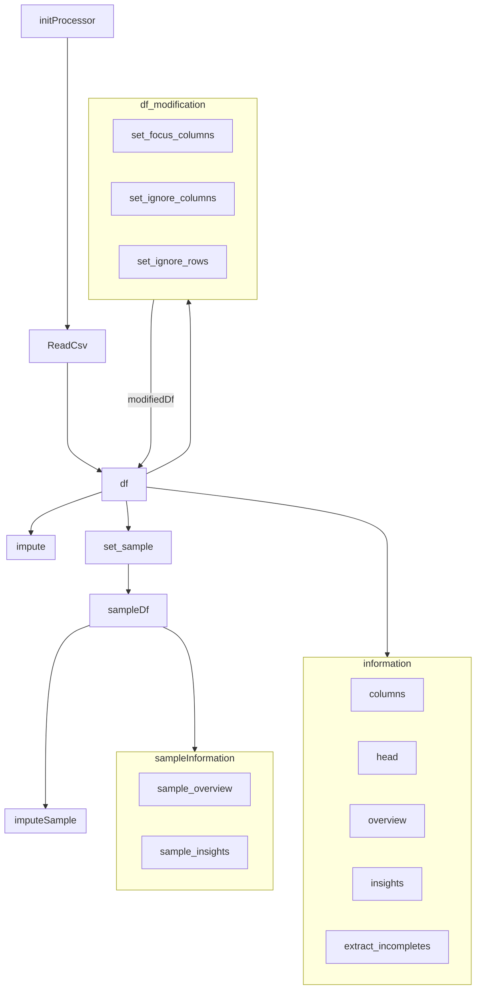

## Questions:

- What we need inside data description, data summary and graphs, in order to help user identify what strategry is required for filling up the missing data.

## Data Processor Workflow

# Profiler Lib Documentation

#### Processor.set_focus(config)

**Parameters**:

- config: Either a list of available columns, or "\*" to select everything
