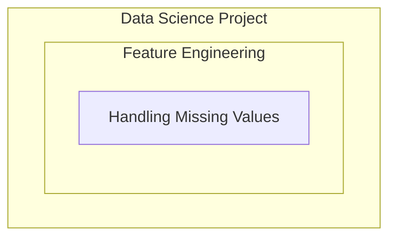
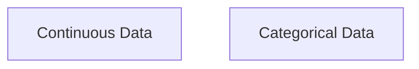

# Types of missing data

**Check with Domain expert to find out the type of missing data.**

### MCAR (Missing completely at randcom)
Probability of being missing is the same for all the observations. 
No relationship between the missing data and any other values. 

[Reference](https://www.youtube.com/watch?v=S6hcGwhNbIM&list=PLZoTAELRMXVPwYGE2PXD3x0bfKnR0cJjN&index=7)

### MNAR (Missing Not At Random)
Systematic missing values 
Some relationship between the data set and the missing values.

e.g. because the people is not survived, so the cabin data is missing

```py
# Create a new data column and fill up by 1 and 0 based on if the value is missed
df['cabin_null'] = np.where(df['Cabin'].isnull(),1,0)

# Fine percentage of null value
df['cabin_null'].mean()

# Calculate the percentage of missing cabin data for people who survived and not survived
df.groupby(['Survived'])['cabin_null'].mean()
```

### MAR (Missing At Random)
Man - hide salary
Woman - hide age

# Techniques of halding missing values
1. Mean / Median / Mode replacement
2. Random Sample Imputation
3. Captuing NAN value with a new feature
4. End of distrubition imputation
5. Arbitrary imputation
6. Frequent categories imputation

### Mean / Median / Mode Inputation
Mean / Median has the assumption the data are missing completely at random (MCAR)
Solve this by replacing the NAN with the most frequent occurance of the variables.
(Use matplotlib render image for before and after imputation for each pair of columns )

Advantages:
- Easy to implement (Robust to outliers)
- Faster way to obtain the complete data set

Disadvantages
- Change / distortion in the original variance
- Impacts correlation

